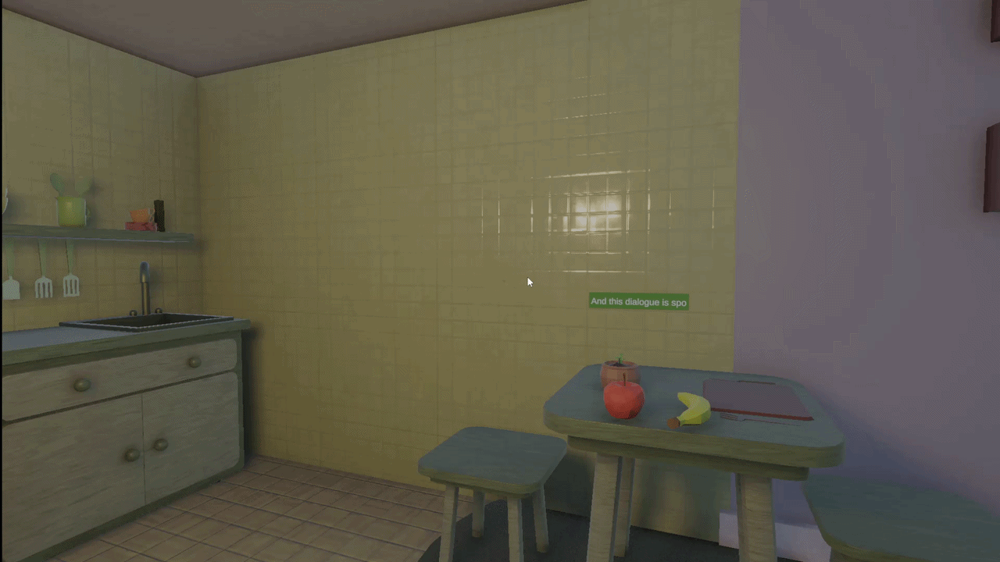

# Narrative Dialogue System — Unity + Ink
A modular, event-driven dialogue system for Unity, built around the [Ink](https://www.inklestudios.com/ink/) narrative scripting language (used in *Disco Elysium*, *Sable*, *Esoteric Ebb*).

<div align="center">
  
</div>

> [!NOTE]
This repository contains isolated scripts extracted from a larger in-development narrative game. Some referenced types (`GameEvents`, `DialogueCharacterConfig`, `Sounds`, etc.) exist in the full project but are not included here.

## Simplified Architecture Overview
``` 
InkHandler  ──(GameEvents)──▶  DialogueController  ──▶  ISpeaker
    │                                                        │
Parses .ink file                                    CharacterDialogue
Tags → Enums                                        Coroutine typewriter
Choices → ChoiceData                                Subtitle fallback
                                                    Camera visibility
```

Components communicate exclusively through a static `GameEvents` class - no direct references between systems. This keeps each class independently testable and replaceable.

---

## Key Features

**`InkHandler.cs`** — Ink runtime wrapper
- Parses Ink tags as strongly-typed enums (`InkTags`) instead of raw strings
- Separates dialogue choices from gameplay choices before passing data upstream
- `TryAction()` enables in-world gameplay events (e.g. picking up an item) to drive Ink choices without Unity needing to know the outcome - Ink handles all branching logic internally

**`CharacterDialogue.cs`** — implements `ISpeaker`
- Typewriter coroutine with per-character vocalization and randomized pitch
- Skip handling: mid-animation skip shows full text; post-animation skip advances story
- Camera visibility check - if the speaking character is off-screen, dialogue automatically switches to subtitles and back in real time
- Text box billboard rotation always faces the camera

---

## Ink Script

The `.ink` file shows what the system supports in practice:

```ink
#player 
This is a dialogue test spoken by the player. 
#flower
And this dialogue is spoken by the flower.
Characters can also speak without a timer. For example... #keep_talking
...like this... #keep_talking
...line by line. #keep_talking
If we want to speak without a timer, use the pause tag. #PAUSE_DIALOGUE
+ [Option 1]
    Picked Option 1.
+ [Option 2]
    Picked Option 2.
```

Supported tags: `#player`, `#flower`, `#keep_talking`, `#pause_dialogue`, `#end_dialogue`  
Choice types: `#dialogue_choice` (UI), `#gameplay_choice` (triggered by in-world interaction)

---

## Design Decisions

- **`ISpeaker` interface** - `DialogueController` has zero knowledge of concrete speaker implementations. New character types can be added without touching the controller.
- **Event-driven** - `OnEnable`/`OnDisable` subscription pattern prevents stale listeners across scene loads.
- **Gameplay choices stay invisible to Unity** - branching logic lives entirely in Ink; Unity only receives the resulting text and tags.
